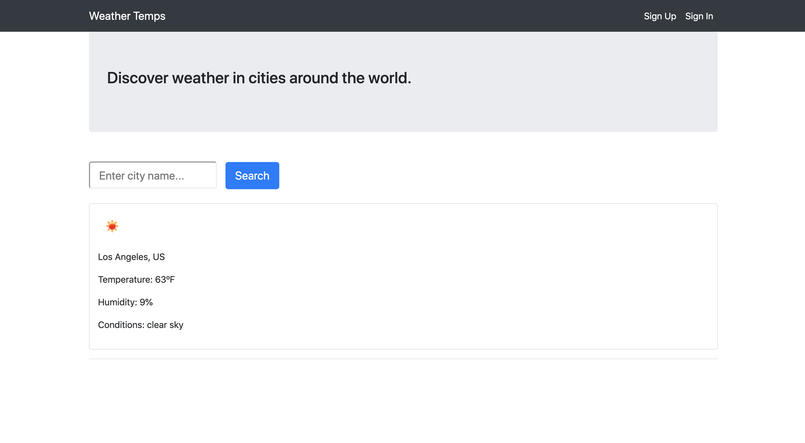

# Weather Temperatures App

This app uses the MERN stack to build a weather search tool. Weather is obtained from the OpenWeatherMap API.

Technologies used in this app include React with Redux, MongoDB, and Node with Express server. The authentication system uses Javascript Web Tokens (JWT) to ensure that passwords are encrypted properly.

The app is deployed at: [Weather Temps App](https://weather-temps.herokuapp.com/)

Screenshot of the app:

